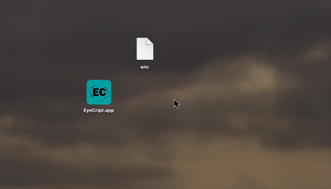

# EyeCript
### Lightweight Full-Stack Encryption Project in C with System-Level IO.

C based project integrating *Applescripts*, *pure C pipe()*, *File Descriptors* and *fork()* to securely handle encryption through *openssl enc*. It showcases a modular structure, error and edge case handling.

The project features an extremely simple UI, prompting the user with interactive Applescripts and descriptive system sounds using built-in *afplay*.

Additionally, a binary footer is appended to the files to store and restore the original extension.

All of these come together to enable a smooth, intuitive and secure program flow.

<p align="center">

</p>

## Features

**Interactive User Interface with Sound Integration:**

Extremely light-weight, yet highly effective and smooth.
- uses pre-existing MacOS utilities, requiring no external imports or audio files
- applescripts in combinations with system available sounds are used to prompt and collect input

**System-Level Secure IO Pipeline:**

All the stdin, stdout & stderr is redirected using C pipe().
- The IO applescripts are executed via exec() inside a fork() process, with their stdout and stderr redirected to the write end of the pipes
- The input flows securely to the *openssl enc* command, that catches it via its built in option *-pass fd:0*

**Binary Footer:**

Saves the extension directly into the encrypted file as bytes, representing the characters themselves followed by their size.

**Error and Stderr Handling:**

All errors are caught, writing descriptive messages directly to stderr and exiting the app with distinctive codes to enable easy debugging.

**Safe Execution:**

Checks for filename conflicts and terminates cleanly.

**MakeFile:**

Automates compilation, execution and debugging.

**Modularity:**

The project is structured in many modules, each with its designated scope.

## Capabilities

1) ### Encryption

Prompts the user to select a file, where and how to save it as and for a password. All the data is written into a pipe given as stdin to the openssl command. If no errors occur, the new encrypted file is created.

2) ### Decryption

Prompts the user to select a file to decrypt and asks for the password. If the password is incorrect, it asks for it again until decryption succeeds or the user closes the UI window.

The extension is read and removed from the footer and the decrypted file is saved with the extension automatically set.

3) ### Preview

Prompts the user to select a file to open and asks for the password. Same procedure as decryption, but this time does not save the decrypted file and just open it with its default application.


## Requirements

The project is intended for MacOS as it uses system available sounds from */System/Library/Sounds/* and utilities (*afplay* and *osascript*).

**Other utilities:** gcc

## How to run
1) git clone https://github.com/1ul1/EyeCript

2) a. **terminal**

    execute ./Contents/MacOS/EyeCript.sh from anywhere

    This bashscript calls upon the Makefile and executes the resulted file.

    b. **App Bundle**

    The repository already follows a minimal MacOS .App bundle structure and everything is already set.

    Just add *.app* to the root repository directory name (EyeCript -> EyeCript.app). The OS will now treat the whole project as an executable and will call upon **./Contents/MacOS/EyeCript.sh** automatically.


### Project Layout
```
EyeCript
    LICENSE
    README.md
    token
    Contents
        Info.Plist
        EyeCript
            Makefile
            src
                main.c
            utils
                get_password.c
                get_new_file.c
                get_file.c
                encryption
                    encryption.c
                decryption
                    decryption.c
                preview
                    preview.c
                    preview_toggle.c
                handle_extension
                    find_extension.c
                    get_extension.c
                    set_extension.c
                apple_scripts
                    choosePassword.applescript
                    options.applescript
                    chooseWhereToSave.applescript
                    selectFile.applescript
                    error.applescript
                    success.applescript
                    error_wrong_password.applescript
                read_output.c
                global_pipe.c
            include
                global_pipe.h
                utils.h
            build
        Resources
            icon.icns
        MacOS
            EyeCript.sh
```